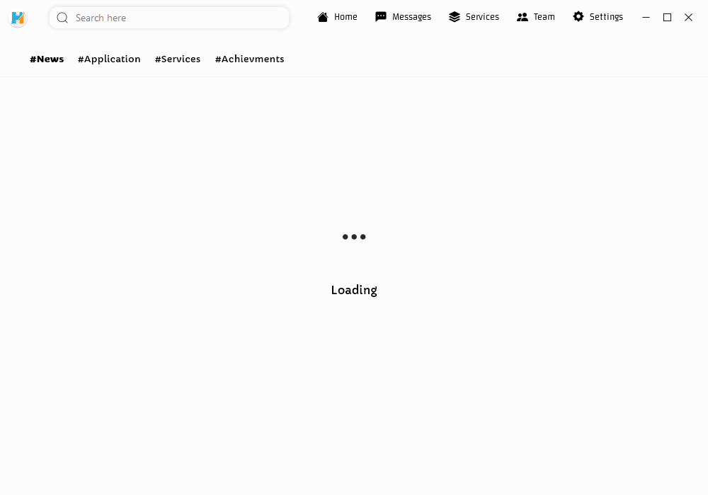

<h1 align="center">
   
  
   
  HabcomSoft&trade;
   
</h1>

<h4 align="center">The official <b>Habcom</b> communiction channel made with <a href="https://sciter.com/" target="_blank">Sciter</a>.</h4>

  
 
   

  <a href="#key-features">Key Features</a> •
  <a href="#how-to-use">How To Use</a> •
  <a href="#download">Download</a> •
  <a href="#license">License</a>

## Key Features

* Discover our latest news, updates, achievements in real-time
* Get support 24/7 with no delay
* Browse though all our services & request right away  
* Cross platform
  - Windows, macOS and Linux ready.

## How To Use

Pretty simple just download and use it

## Download

You can [download](https://github.com/amitmerchant1990/electron-markdownify/releases/tag/v1.2.0) the latest installable version of HabcomSoft for Windows, macOS and Linux.

## Credits

This software uses the following open source packages:

- [Sciter](https://sciter.com/)
- [Visual Code](https://code.visualstudio.com/)
- [Heroku](https://www.heroku.com/)
- [Flask](https://flask.palletsprojects.com/)
- [Flask-restful](https://flask-restful.readthedocs.io/en/latest/)

## You may also like...

- [HabcomSoft (android)](https://play.google.com/store/apps/details?id=com.omarsoft.habcomsoft) - Our HabcomSoft android version
- [Lost & Found](https://play.google.com/store/apps/details?id=omarsoft.outlook.fr.urndlostfound_v2) - Lost and Found property in Uganda 
- [Computer Glossary](https://play.google.com/store/apps/details?id=omarsoft.outlook.fr.computerglossary) - A dictionary for computer / techology terms 
- [Computer Glossary (Windows)](https://www.softpedia.com/get/Others/Home-Education/Computer-Glossary.shtml) - A dictionary for computer / techology terms (Desktop version)

## License

GNU

---

> [Habcom](https://www.amitmerchant.com) &nbsp;&middot;&nbsp;
> GitHub [@fanom2813](https://github.com/amitmerchant1990) &nbsp;&middot;&nbsp;
> Gmail [@fanom2813](https://twitter.com/amit_merchant)
